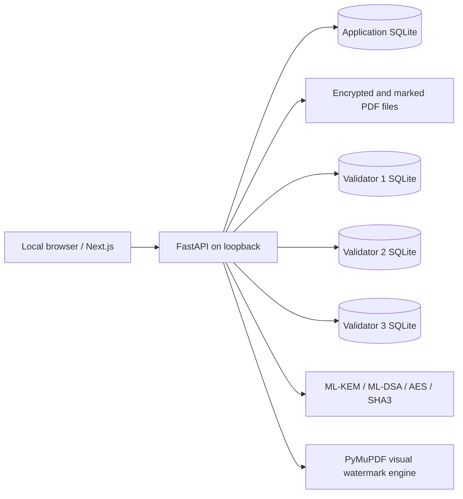

# SourceX · SIH26237

**SIH 2026 Prototype — Not an official Ministry of Defence deployment.** Standards-based research prototype for fictional identities and synthetic PDFs. Do not upload classified or sensitive real material.

This local web application demonstrates one AES-256-GCM encrypted PDF distributed to multiple recipients through separate ML-KEM-768 key envelopes. Every successful recipient decryption creates a distinct visually marked PDF, an ML-DSA-65 signed event, and a hash-linked block signed by a quorum of three local logical validators. A forensic upload detects the rendered-content watermark and checks the recipient signature, ledger chain and quorum.

## What works

| SIH26237 objective | Demonstration |
|---|---|
| Encrypt once, share with several recipients | One content ciphertext; per-recipient ML-KEM envelopes wrap the same content key |
| Unique copy per decryption | Fresh UUID, nonce, visual carrier, file hash and signed event |
| Attributable leaked PDF | Reference-assisted rendered-page detector identifies a session; signature and chain verified |
| Offline tamper evidence | Three separate SQLite validator stores, ML-DSA validator votes, 2-of-3 quorum |
| Video-friendly demonstration | Local role login, status dashboard, distribution, forensic report and tamper lab |

The API enforces local sender, recipient, investigator and auditor roles. Sessions use an HttpOnly cookie, an eight-hour absolute expiry, a 15-minute inactivity expiry and CSRF checks for state-changing requests. Login and expensive actions are rate limited. This remains a demo identity system with published fixture passwords and local key storage; keep the API on loopback. Validator keys and application data share one host, so this is a replicated *demonstration* of DLT principles, not independently operated distributed consensus.

## Stack and prerequisites

- Windows 10/11 with **Python 3.14**, **Node.js 24** and npm 11. These are the versions used to test this copy.
- Python: FastAPI 0.142.2, cryptography 50.0.2 (NIST-named ML-KEM-768 and ML-DSA-65), PyMuPDF 1.28.2, Pillow 12.3.0, NumPy 2.5.3 and OpenCV 5.0.0.93.
- Web: Next.js 16.3.6, React 19.3.0, TypeScript 5.9, Tailwind 4.3.3 and locally bundled Lucide icons.
- SQLite stores all metadata and each validator's chain independently. There is no cloud API, public chain, external font, CDN, analytics or online translation service in the app.

All dependencies must be installed while a package source is available. The **runtime works without Internet access once dependencies and the web build are present**. See the exact scope of the offline check below.

## Install

From a PowerShell terminal in this folder:

```powershell
py -3.14 -m venv .venv
& .\.venv\Scripts\python.exe -m pip install -r requirements.txt
cd apps\web
npm ci
npm run build
cd ..\..
```

The `cryptography` package must support ML-KEM and ML-DSA. The backend runs a real startup key-generation/encapsulation/signature self-test and fails closed if unavailable. No classical asymmetric fallback exists.

## Run

Open **two** PowerShell terminals in this folder:

```powershell
# Terminal 1
.\start-api.ps1
```

```powershell
# Terminal 2
.\start-web.ps1
```

Open **http://127.0.0.1:3000**. The local API and interactive API reference are at `http://127.0.0.1:8000` and `http://127.0.0.1:8000/docs`.

The signed-out SourceX home page introduces the four RBAC roles in order: Document Authority, Recipient, Forensic Investigator and Auditor. Each role section has a sign-in action and a link to the next role. Sign-in opens the same role-checked local workspace used by the demo flow. Its backgrounds are actual Indian defence photographs published by PIB: Indian Air Force LCA Tejas, Indian Navy aircraft carrier Vikrant, an Indian Army contingent, and the Republic Day rehearsal at Kartavya Path. The landing page keeps image credits in a collapsible footer section. The photographs are bundled locally under `apps/web/public/imagery/`; see [IMAGE_CREDITS.md](docs/IMAGE_CREDITS.md) for original URLs and reuse terms. Scroll reveals, subtle scene motion, the short SourceX opening animation and loading indicators respect reduced-motion preferences. No external images, fonts or services are needed to render the page.

### Demo accounts

| Role | Account ID | Password |
|---|---|---|
| Document Authority | `sender` | `Sender-2026!` |
| Recipient | `REC-001` | `Arjun-2026!` |
| Recipient | `REC-002` | `Meera-2026!` |
| Recipient | `REC-003` | `Vikram-2026!` |
| Forensic Investigator | `investigator` | `Investigator-2026!` |
| Auditor | `auditor` | `Auditor-2026!` |

Use **Sign out** to change accounts. The sender may create recipients with new passwords, upload and distribute documents. Each recipient sees only documents addressed to that account and may decrypt only their own envelope. The investigator uploads a found PDF for watermark analysis. The auditor verifies the chain and runs the demonstration-only tamper test. These published credentials are for fictional local demo data only.

The API seeds three fictional recipients and one synthetic encrypted sample document on its first start. To seed explicitly:

```powershell
& .\.venv\Scripts\python.exe scripts\seed_demo.py
```

To **reset**, stop the API first, then run:

```powershell
& .\.venv\Scripts\python.exe scripts\reset_demo.py
```

This deletes only this project's `data/` directory and recreates demo keys, identities, sample PDF and genesis blocks. Old downloads and reports then become invalid.

## Exact three-minute demo

1. Sign in as `sender`. Show Dashboard: PQC `READY`, watermark `READY`, 3/3 validator quorum, synthetic sample document.
2. Open Documents; select the seeded PDF and all three recipients, then click **Create recipient envelopes**. The response confirms content encryption count 1.
3. Sign out and sign in as `REC-002`. Open Decrypt; click **Decrypt & commit event** for the addressed document, then download the image-only marked PDF.
4. Sign out and sign in as `investigator`. Open Forensics and upload that downloaded PDF. Inspect the visual correlation score, recipient, ML-DSA signature, block hash and 3/3 validator quorum. Export JSON or printable HTML evidence.
5. Open Ledger; load blocks, inspect the decryption block and click **Verify signature**; then click **Verify entire chain** and **Run independent check**. The latter runs a read-only public-key verifier in a separate process.
6. Sign in as `auditor`. Run **Demonstration-only tamper test** against validator-2. Verification shows validator-2 `DIVERGED` while the 2/3 matching chain remains valid. Restore validator-2.
7. Optionally run the Watermark Robustness Lab for PDF re-render and JPEG quality 85/65 results.

Technical attribution identifies the recipient session that produced a copy. It does not determine who leaked it or make any legal conclusion.

## Tests and offline check

```powershell
& .\.venv\Scripts\python.exe -m pytest -q --basetemp=.pytest_tmp
& .\.venv\Scripts\python.exe scripts\run_demo_checks.py
& .\.venv\Scripts\python.exe scripts\benchmark_watermark.py
cd apps\web
npm run typecheck
npm run build
# With both local services running and Chrome installed:
npm run smoke
```

The eight backend/API tests cover real PQ key establishment and signatures, wrong-recipient failure, AES tampering, distinct watermarks, metadata stripping, re-render, 90% resize, JPEG 85/65, small shift/rotation, image-only issued copies, end-to-end attribution, chain tampering, the separate verifier, throttling, session expiry, 2-of-3 quorum and restoration. `benchmark_watermark.py` checks 18 marked-copy digital transformations and six negative controls on three synthetic PDFs; see [UPGRADE_EVIDENCE.md](docs/UPGRADE_EVIDENCE.md) for measured results and limits. `run_demo_checks.py` blocks non-loopback socket connection attempts inside the Python process while running the main demonstration. `npm run smoke` drives the role-based journey in Chrome, checks browser errors and third-party requests, and creates new synthetic demo records; reset afterward for a clean video. This is not a firewall-level isolation test; the UI reports outbound isolation as `UNVERIFIED` until that broader check is performed. `runtime_external_dependencies: 0` refers to app design, not formal air-gap certification.

## Docker Compose (provided, untested on this PC)

Docker is not installed in the development environment, so the Compose path has not been exercised. After image/dependency download and build:

```powershell
docker compose build
docker compose up
```

The Compose network is marked internal and only loopback ports 3000 and 8000 are published. Verify Docker behavior on your machine before relying on it for an isolated demo. The tested run path above uses local Python and Node.

## Architecture



See the full [SourceX PRD](docs/SOURCEX_PRD.md), measured [upgrade evidence](docs/UPGRADE_EVIDENCE.md), [architecture.md](docs/architecture.md), [threat-model.md](docs/threat-model.md), [REQUIREMENTS_MAPPING.md](docs/REQUIREMENTS_MAPPING.md) and [demo-script.md](docs/demo-script.md).
The [public peer comparison](docs/PEER_COMPARISON.md) records where this demo is strong and where other SIH26237 repositories currently document stronger technical evidence.

## Folder guide

```text
apps/web/                 Next.js user interface
services/api/provenance/  FastAPI, cryptography, watermark, ledger, storage
scripts/                  Seed, reset and offline workflow check
tests/                    Cryptography and end-to-end tests
docs/                     Architecture, threats, coverage and demo script
data/                     Generated local secrets, databases and PDFs (ignored by Git)
```

## Security limitations and future architecture

- Keys are sealed with a local master file on the same machine. A privileged host compromise can access them. Production would use hardware-backed key storage and independent validator operators.
- Demo credentials are fixed and documented, passwords are stored as salted scrypt hashes, and sessions remain on the same local host. Login throttling and idle/absolute expiry are implemented, but this does not replace production identity proofing, MFA, account recovery, device-bound keys or independent audit administration. The API must not be exposed to untrusted clients.
- The reference-assisted visual carrier is tested for exact copies, metadata removal, PDF re-render, 90% resize and selected JPEG quality levels. It is not proven against hostile editing, collusion, heavy crop/rotation, screenshot recomposition, print/scan or adversarial watermark removal. Low confidence returns `INCONCLUSIVE`.
- PDF-first prototype: 15 MB, 12 pages, no encrypted uploads. New issued copies are image-only before watermarking; the encrypted source keeps its original text. This prevents simple copy-and-paste from the issued PDF but cannot stop OCR, screenshots or retyping. Those reconstructions are inconclusive, not attributable.
- Logical validators have independent storage and signed votes but one coordinator process and one host. A second read-only verifier runs in a separate process and uses only public keys; it does not make the validators independently governed or Byzantine fault tolerant.
- No FIPS certification, defence accreditation, security audit or classified-use approval is claimed. This remains a **standards-based research prototype**.

Future production work: HSM/smart-card recipient keys, independently hosted validators with authenticated networking, stronger watermark evaluation on a large document corpus, enterprise identity integration with MFA, secure key recovery/rotation and formal red-team review.

## Design references

The interface uses information hierarchy, accessibility controls, bilingual navigation cues and document search patterns informed by current official Indian government portals, while keeping original branding and an explicit prototype banner. See [architecture.md](docs/architecture.md) for primary official references. The UI does not clone a government site.
