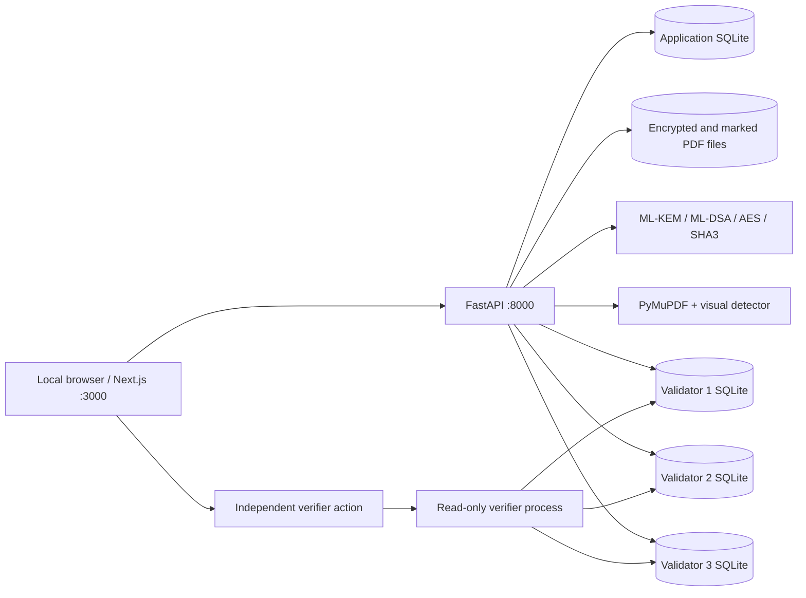

# SourceX — Product Requirements Document

**Version:** 1.2 · **Date:** 3 October 2026 · **Status:** Implemented localhost demonstrator with measured follow-up requirements  
**Owner:** SourceX project team · **Organization in problem statement:** Ministry of Defence · **Category:** Software · **Theme:** Blockchain & Cybersecurity

> **SIH 2026 Prototype — Not an official Ministry of Defence deployment.** SourceX is a standards-based research prototype for fictional accounts and synthetic PDFs. It is not approved for classified or operational material.

## 1. Executive summary

SourceX demonstrates cryptographic attribution of a specific *decrypted copy* of a PDF. A sender encrypts one PDF once and authorizes multiple recipients using separate ML-KEM-768 key envelopes. Each successful recipient decryption creates a fresh session and a visually unobtrusive watermark in rendered PDF content, signs the event with ML-DSA-65, and commits it to a three-replica local, hash-linked ledger after a two-of-three validator quorum. An investigator uploads a found PDF; the system detects the content watermark and independently verifies the recipient signature, event, chain, validator signatures and quorum. An auditor can inspect these proofs and safely corrupt one replica for a demonstration.

The product is designed for a credible three-minute, offline SIH jury demonstration. It is deliberately scoped to PDFs, one local machine, fictional identities and a clear technical claim. **A verified match identifies the session that produced a copy. It does not establish who disclosed it, intent, guilt or legal responsibility.**

**Current evidence, 3 October 2026:** The four-area upgrade has been implemented and checked with backend tests, a browser walkthrough, an offline core-flow check and a small deterministic watermark benchmark. The benchmark detected 18/18 marked variants and correctly left 6/6 negative controls inconclusive. These are regression results on generated data, not a general false-positive rate or a claim that SourceX is more secure than independently operated ledger products. [Measurement details](UPGRADE_EVIDENCE.md).

## 2. Problem and desired outcome

Ordinary encrypted distribution can establish who *could* open a document, but a later leaked copy may not show which access produced it. Ordinary mutable audit logs can be edited after the fact. SourceX couples each successful access to (1) a distinct rendered-content carrier in the output, (2) a recipient-signed canonical event and (3) an independently verifiable replicated ledger entry.

**Primary outcome:** Given a marked PDF produced by an authorized decryption, the investigator receives a `VERIFIED MATCH` naming one decryption session and recipient, with valid watermark, signature and ledger evidence. Ambiguous or failed evidence yields `INCONCLUSIVE`, `INVALID` or `UNAVAILABLE`, never a green attribution.

**Jury success:** From a clean demo state, a team member can distribute a PDF to three people, decrypt it as REC-002, upload that actual downloaded copy as investigator, show all proof checks, and demonstrate detection of one corrupted ledger replica within three minutes.

## 3. Scope and priority

| Priority | Requirements |
|---|---|
| P0 — demonstration gate | Real ML-KEM-768 and ML-DSA-65; encrypt once; independent recipient envelopes; authorized decrypt; unique session, rendered watermark and extraction; signed event; three local validator stores and 2/3 quorum; forensic attribution and failure states; offline local runtime; reset/seed; basic server-side security. |
| P1 — jury clarity | SourceX landing experience, role sign-in, dashboard, document register, ledger explorer, evidence export, single-node tamper and restore, watermark robustness lab, system status, accessibility and Hindi navigation labels. |
| P2 — optional | More transformation classes, richer visualization of watermark detection, additional report styling, independently hosted validators and extended operational controls. |

**Explicit exclusions:** Real classified files, military deployment, production identity proofing, public blockchain, cryptocurrency, cloud KMS, external authentication, Aadhaar, Active Directory, HSM, mobile app, OCR, arbitrary file types, AI, smart contracts, perfect print/scan recovery, collusion-resistant tracing, nationwide PKI and formal legal attribution.

### 3.1 Four quality parameters for jury comparison

| Parameter | Demonstrable requirement | Current evidence | Boundary / next proof |
|---|---|---|---|
| Watermark resilience | Attribute a uniquely marked PDF after selected digital transformations, and decline uncertain matches. | 18/18 marked variants detected across three generated documents; 6/6 unmarked or text-only controls correctly inconclusive. | Run a larger blind corpus with unseen PDFs and report false positives/negatives. No print/scan or hostile-removal claim. |
| Selectable-text leakage | An issued copy should not offer a plain selectable text layer that trivially bypasses the visual mark. | New copies are rendered to image-only PDFs before marking; a text-only reconstruction is a negative control. | OCR, screenshots and retyping remain possible. Image-only output reduces accessibility, searchability and text selection. |
| Ledger verification independence | A second code path must recompute signed evidence from public material without trusting cached status. | Separate read-only process validates 3/3, flags one divergent replica with 2/3 quorum, then validates 3/3 after restore. | Validators and signing keys still share one host; separately governed nodes are future work. |
| Web application security | Enforce role ownership and time-limited sessions; slow guessing/expensive actions; reject hostile browser input. | Idle and absolute expiry, login and action throttles, CSRF, Origin checking, schema bounds and response headers were exercised in tests and browser checks. | Demo passwords are public, PDF parser isolation/body streaming limits are incomplete, and no penetration test has been done. |

**Comparison rule:** Present these as measured SourceX capabilities. A claim that SourceX outperforms another entry requires the same blind corpus, threat model and test hardware for both systems. Never compare a one-host prototype's governance with independently operated validator organizations as if they were equivalent.

## 4. Users, accounts and permissions

| Role | Purpose | Allowed actions | Forbidden actions |
|---|---|---|---|
| Document Authority / Sender | Create and distribute protected PDFs. | Upload synthetic PDFs; create and revoke demo recipients; choose recipients; distribute; inspect document and ledger status. | Decrypt as another recipient; operate forensic investigation; tamper with validators. |
| Recipient | Access only addressed documents. | View own recipient record and addressed documents; decrypt own envelope; download own marked sessions. | Read another recipient's copy or keys; select another identity in the API; upload/distribute; investigate; tamper. |
| Forensic Investigator | Analyze a found PDF. | Upload suspect PDF; inspect watermark and independent verification; export evidence; inspect relevant ledger events. | Decrypt or distribute; download recipient copies; tamper or restore validators. |
| Auditor / Administrator | Verify system integrity. | Inspect registry, blocks, signatures, quorum, system status; execute labelled demo tamper and restore. | Decrypt recipient documents; claim a legal conclusion. |

Seeded accounts: `sender`, `REC-001` (Major Arjun Rao), `REC-002` (Lt. Commander Meera Singh), `REC-003` (Analyst Vikram Sharma), `investigator`, and `auditor`. Their credentials are intentionally published for local demonstration. The recipient identities and designations are fictional. UI navigation is role-specific, but **the API is the authority for access control**.

## 5. Complete user journeys

### 5.1 Sender: create and distribute

1. Sign in as Document Authority; dashboard shows live crypto, watermark, storage and quorum status.
2. Upload an unencrypted synthetic PDF or use the seeded sample. Choose `OFFICIAL`, `DEMO RESTRICTED`, or `CONFIDENTIAL — DEMO ONLY` (classification labels are illustrative).
3. Select one or more active recipients and confirm distribution.
4. Backend generates one random 256-bit content-encryption key (CEK), encrypts the PDF once with AES-256-GCM, then creates a separate ML-KEM-768 envelope for each recipient. Each encapsulated secret derives a recipient/document-bound key-encryption key with HKDF-SHA3-256; AES-GCM wraps the *same* CEK.
5. UI shows one ciphertext, recipient envelope count, original/ciphertext hashes and status. Distribution to revoked or unknown identities is rejected.

### 5.2 Recipient: decrypt and claim a copy

1. Sign in as an addressed recipient; only that account's documents appear.
2. Select a document and start decryption. The server binds the request to the signed-in recipient, decapsulates their ML-KEM envelope, unwraps the CEK and authenticates the document ciphertext.
3. Generate a new session UUID and nonce; render an image-only issued PDF, embed a distinct low-opacity visual carrier, hash the final file and commit to the watermark/session payload. This closes simple selectable-text copy from the issued PDF but not OCR, screenshots or retyping.
4. Canonicalize and sign the event with the recipient's ML-DSA-65 key. Validators verify, vote with ML-DSA-65 and commit only with at least 2/3 valid approvals. The signed event records the issued-copy mode so a later investigator uses the correct rendered reference.
5. Release the marked PDF only after quorum. The download endpoint rechecks ownership, signed event/ledger validity and the marked-file hash. Every repeat decryption produces a new session and different marked bytes.

### 5.3 Investigator: analyze a found PDF

1. Sign in as investigator and upload a suspect PDF. Show genuine processing state; the UI must not animate fake completed stages.
2. Hash the input; validate and render its pages. Compare rendered pixels with the authenticated original and issued session patterns. Do not read metadata as the watermark or use exact file hash as the matching decision.
3. Accept a unique match only above signal, correlation and winner-margin thresholds. A weak or ambiguous signal yields `INCONCLUSIVE` with no named recipient.
4. Locate the session's event, verify the ML-DSA signature, event hash and watermark commitment, inspect the chain and validator signatures, and establish quorum.
5. Display `VERIFIED MATCH` only when *all* required checks pass. Show document, recipient, session, timestamp, correlation score, signature status, block hash and quorum. Call the score a **correlation score**, never a calibrated probability. Permit JSON and printable HTML export.

### 5.4 Auditor: verify and tamper demo

1. Inspect block height, previous hash, event root/hash, recipient signature and validator approvals.
2. Re-run verification rather than trusting stored success flags. Run the separate read-only verifier, which opens validator stores without writing to them and uses public keys to recompute the chain, recipient signatures, validator votes and quorum.
3. Run a clearly labelled `DEMONSTRATION ONLY` action that corrupts validator-2's local replica. Verification should show that replica `DIVERGED`, two matching healthy replicas, 2/3 quorum and a valid authoritative chain.
4. Restore the replica and show 3/3 agreement. Never expose demo tamper controls to non-auditors.

## 6. Screens and interaction requirements

| Screen | Required content and behavior |
|---|---|
| Public SourceX landing | Prominent SourceX title, short opening animation (~1–2 s), story and role sections, role sign-in actions, persistent prototype warning, local Indian defence photographs, discreet footer image credits. Motion respects reduced-motion settings. |
| Sign-in | Account ID/password, role preselection from landing, useful error state, disabled busy state, no account-existence disclosure on failure. Published credentials remain demo-only. |
| Dashboard | Live counts for documents, recipients, decryptions, blocks, investigations; recent authorized records; PQC/watermark/air-gap/validator health from API. |
| Documents / Distribute | PDF upload; classification; searchable/filterable/sortable register; document details; recipient selection; one-ciphertext and envelope confirmation. |
| Recipients | Names, designations, active/revoked status, public key fingerprints, decryption counts, public-key view; sender-only creation/revocation. No private key response. |
| Decrypt | Own addressed documents; explicit ML-KEM → AES → watermark → ML-DSA → quorum explanation; signed session and download. |
| Ledger | Linked blocks, event details, hash and approval values, signature re-verification, whole-chain verification, a separate read-only public-key verification action, validator status, auditor-only tamper/restore. |
| Forensics | Suspect PDF selection, real processing/results, unique attribution or explicit failure, score explanation, evidence export, robustness lab. |
| System | Actual backend/PQC/watermark/database/validator states, quorum and external-dependency design statement. Do not equate a configured local runtime with certified air-gap isolation. |
| Help | Demo journey, accessibility, policies, contact/feedback route, sitemap, limitations. |

Use restrained navy, slate, white, muted teal and limited saffron; readable data tables; keyboard focus; semantic headings; skip link; adequate contrast; responsive layout; local icons/assets; no online fonts/CDNs/analytics. The limited Hindi dictionary covers main navigation without an online translation service. The banner must say **“SIH 2026 Prototype — Not an official Ministry of Defence deployment.”**

## 7. Functional acceptance criteria

| ID | Acceptance criterion |
|---|---|
| F-01 | One uploaded PDF yields exactly one content ciphertext; three recipients yield three different ML-KEM envelopes protecting the same CEK. |
| F-02 | A different recipient's key cannot unwrap another recipient's CEK. Ciphertext tampering fails AES-GCM authentication. |
| F-03 | Two successful decryptions produce different session IDs, nonces, marked file hashes, signed events and ledger entries. |
| F-04 | A marked PDF remains visually similar to the source, contains no selectable text layer in new sessions, and is detected after metadata removal and selected digital transformations. Text-only re-creation returns inconclusive. |
| F-05 | Unmarked/ambiguous PDFs do not attribute a recipient. Modified signed events fail signature/ledger verification. |
| F-06 | Copy release requires a valid ledger commit with at least two distinct signed validator approvals. One divergent replica is identified and can be restored. |
| F-07 | Recipient ownership and all role permissions are enforced by the API, including direct URL/API attempts. |
| F-08 | The core demonstration works after installation with outbound network blocked; browser runtime emits no third-party requests. |
| F-09 | Demo seed/reset restores a clean synthetic state in seconds; all key, ledger and report states are regenerated consistently. |
| F-10 | The watermark benchmark identifies the correct session for exact, re-rendered, JPEG-65, 90%-scaled, two-pixel-shifted and one-degree-rotated copies of each generated source, while unmarked originals and text-only reconstructions stay `INCONCLUSIVE`. A failing case blocks a claim of robustness for that transformation. |
| F-11 | New issued copies have no selectable text layer. The UI and evidence distinguish this copy-control measure from watermark resilience and disclose the loss of searchability/accessibility plus OCR, screenshot and retyping bypasses. |
| F-12 | The separate verifier reads public keys and validator databases without mutating them; it reports 3/3 healthy, 2/3 with validator-2 corruption and 3/3 after restore, and fails on invalid recipient or validator signatures. |
| F-13 | Idle expiry, absolute expiry, login throttling, sensitive-action limits, hostile-Origin rejection, CSRF, role ownership and response headers are enforced by the server. Focused tests cover the recent controls; a complete route-by-role and attack-surface matrix remains a release gate for wider access. Security gaps remain explicit in Section 9. |

## 8. Architecture, trust boundaries and data

Trust boundary: all browser inputs, including role, filenames, document IDs and PDF bytes, are untrusted. FastAPI authorizes each operation and must validate every input. Application metadata, the master file, sealed recipient seeds and validator keys currently live on one workstation. The three replicas provide a **demonstration of tamper evidence**, not independence from host compromise or real multi-site consensus.

**Data entities:** `User`, `AuthSession`, `Recipient`, `Document`, `RecipientEnvelope`, `DecryptionSession`, `WatermarkRecord` (logical commitment/session fields), `DecryptionEvent`, `LedgerBlock`, `ValidatorVote`, `Investigation`, `AuditRecord`. Current implementation stores some related values within session/event/validator records rather than separate tables; a migration must preserve signed canonical bytes and historical verification.

**Canonical event fields:** schema version, algorithm suite, event/session/document IDs, original SHA3-256, recipient ID/signing fingerprint, UTC timestamp, random nonce, carrier version/commitment and marked PDF SHA3-256. Canonicalization is UTF-8 NFC JSON with recursively sorted keys, compact separators and no floats; the signature uses a domain-separated context. A ledger block has version, height, previous hash, UTC creation time, event hashes/root, proposer, block hash and individually signed validator approval payloads.

**Retention:** The prototype retains ciphertext, marked copies, events, audit records and investigation results locally until reset. Define a production retention schedule, legal hold, secure deletion policy and backup plan before handling real data. Reset invalidates old local evidence and downloads by regenerating identities and genesis state.

## 9. Security requirements and current-state audit

Status terms: **Implemented** means visible in the current code or tests; **Partial** means a control exists but does not cover the whole requirement; **Missing** means no implementation was found in this repository. These are code-review observations, not a penetration-test result.

| ID / priority | Control and requirement | Current state (2 Oct 2026) | Required work / acceptance test |
|---|---|---|---|
| S-01 P0 | Server-enforced absolute session expiry. | **Implemented:** random bearer token, SHA-256 token hash in SQLite, 8-hour server expiry and matching cookie `Max-Age`. | Add test using a clock advance: expired token returns 401 for all private endpoints and cannot download. |
| S-02 P0 | Server-enforced inactivity expiry and clear UX. | **Implemented/partial:** 15-minute idle and eight-hour absolute expiry are enforced server-side; the client clears state on 401. No advance warning or configurable recording window. | Test idle expiry and activity reset; add a warning before expiry if it improves the demo. This is not a claim of a NIST assurance level. |
| S-03 P0 | Login throttling and brute-force resistance. | **Implemented/partial:** five failures in five minutes per account or twenty per minute per source trigger a temporary 429; expensive actions have per-user limits. Published demo passwords still require loopback-only use. | Test cooldown recovery and concurrent attempts; tune limits against target laptop and support a secure shared-deployment credential mode before wider use. |
| S-04 P0 | Password handling and account lifecycle. | **Partial:** per-user salted scrypt hash (`N=2^14,r=8,p=1`), generic login failure, revoked recipients blocked and their sessions removed. Demo credentials are published; no password change/MFA. | Keep demo mode explicitly local. For any shared deployment, require unique secrets, MFA, stronger current password hashing parameters, password rotation/reset and session revocation on change. Add lifecycle tests. |
| S-05 P0 | Cookie and session transport. | **Partial:** `HttpOnly`, `SameSite=Strict`, `Path=/`; `Secure=False` because current origin is HTTP loopback. Token is not placed in browser storage; CSRF token is in sessionStorage. API responses include `Cache-Control: no-store`. | Enforce loopback binding for demo. For any non-loopback deployment, require HTTPS, `Secure`, host-only cookie and appropriate `__Host-` prefix; reject insecure startup. Test download headers and restart behavior. |
| S-06 P0 | CSRF and browser origin policy. | **Implemented/partial:** all authenticated mutations require `X-CSRF-Token`; credentials CORS allowlist is two local web origins; disallowed browser Origins are rejected. | Test missing/wrong token for every mutating route and hostile Origin/Host combinations. Document allowed origins; do not relax CORS to `*`. Consider CSRF token rotation with session renewal. |
| S-07 P0 | Server-side RBAC and object ownership. | **Implemented:** API role dependencies, recipient ID binding and own-session download checks; revocation blocks access. | Build an endpoint-by-role matrix test for every route, including robust lab and reports. Ensure read endpoints do not reveal other recipients' sessions or keys. Never rely only on hidden buttons. |
| S-08 P0 | Request schema, canonicalization and output encoding. | **Partial:** Pydantic types/lengths, classification/recipient-format allowlists, unique bounded recipient lists, normalized text without control characters, canonical signed JSON, parameterized SQLite, React and printable-report escaping. Some path IDs and filenames need tighter rules. | Validate UUID/validator formats, filename length/characters and edge-case Unicode; keep context-aware escaping. Test script-like names without executable output. |
| S-09 P0 | PDF upload validation and parsing containment. | **Partial:** 15 MiB read cap, declared 16 MiB request cap, `%PDF-` prefix, PyMuPDF parse, unencrypted PDF, 1–12 pages, page dimension and 5-megapixel render caps; generated paths. | Add a streaming request cap for absent/false `Content-Length`; isolate PDF parsing in a low-privilege worker with CPU/memory limits; fuzz malformed PDFs. Do not trust filename or MIME type. |
| S-10 P0 | Resource exhaustion protection. | **Partial:** file/page/pixel and corpus caps, plus per-user action limits. No hard parser CPU deadline, isolated worker or storage quota. | Cap concurrent forensic jobs and total rendered pixels, enforce process time/memory limits and storage retention; test a valid but costly PDF and many-session corpus. |
| S-11 P0 | Browser security headers and XSS defense. | **Implemented/partial:** React and report output escaping, Next CSP and no-sniff/frame/referrer headers, API no-store and report CSP. Current web CSP permits inline scripts/styles for framework compatibility. | Test browser CSP in the production build; narrow inline allowances where feasible; never render untrusted HTML with `dangerouslySetInnerHTML`. |
| S-12 P0 | Secrets and private keys. | **Partial:** recipient/validator private seeds sealed with AES-GCM; local master created with restrictive file mode request; private keys excluded from public APIs. Master and ciphertext share the host. | Verify Windows ACLs and Unix permissions on `data/`, master and SQLite files; redact secrets from logs/errors/reports; ensure data is gitignored; document backup/rotation. Hardware-backed keys and separate validator operators are production work. |
| S-13 P0 | Integrity and fail-closed crypto. | **Implemented:** ML-KEM/ML-DSA/AES self-test; no classical asymmetric fallback; AES-GCM associated data and hash checks; canonical event and validator signatures; release after quorum. | Keep negative/tamper tests as gates; pin versions and monitor advisories. Never show `READY` from static UI data; error states must block decrypt and attribution. |
| S-14 P0 | Forensic false-attribution control. | **Partial:** correlation/signal/winner-margin thresholds and `INCONCLUSIVE` state, reference-assisted detector. Thresholds are conservative starting points, not corpus-calibrated. | Build larger negative/positive corpus, report false positive/negative rates, test adversarial transplantation/collusion and document threshold tuning before stronger claims. Correlation is not probability. |
| S-15 P1 | Audit trail, error handling and privacy. | **Partial:** login success/failure/throttle, action throttle, distribution, decryption, analysis and demo tamper/restore are logged; security denials and expiry are not systematically audited. Some `ValueError`/`RuntimeError` responses include raw exception detail. | Log authorization denial and session expiry with correlation IDs but no passwords, tokens or PDF contents. Return safe user messages and keep internal traces in local protected logs. Apply retention. |
| S-16 P1 | Network exposure and offline proof. | **Partial:** start scripts bind loopback; Compose publishes loopback and declares an internal network; browser smoke checks unexpected third-party requests. Docker path is untested here; outbound isolation display is `UNVERIFIED`. | Verify listeners bind only `127.0.0.1`; test actual firewall/egress denial on target demo machine; audit packages/assets for runtime fetches; never label the system certified air-gapped. |
| S-17 P1 | Supply chain and release provenance. | **Partial:** Python versions pinned; npm lock file used. No recorded dependency scan, signed release or SBOM gate. | Generate an offline-installable dependency cache/SBOM; review advisories before demo; record exact tested versions and hashes; do not auto-update during presentation. |
| S-18 P1 | Backup, recovery and physical security. | **Missing:** no protected backup or disaster recovery. | Define encrypted backup and restore drill for any durable use. Keep demo machine and downloaded PDFs under operator control; wipe demo data after public presentations. |

**Immediate security conclusion:** SourceX now includes idle expiry, login/action throttling and browser headers, alongside cryptographic, ownership and CSRF controls. Published credentials, partial PDF parsing containment and the single-host key store still make it suitable only for a controlled localhost demonstration. Before wider access, complete the remaining S-04, S-05, S-08, S-09, S-10 and S-12 work and an independent security review. See [measured upgrade evidence](UPGRADE_EVIDENCE.md).

The session requirements follow [NIST SP 800-63B session guidance](https://pages.nist.gov/800-63-4/sp800-63b/session/) and the [OWASP Session Management Cheat Sheet](https://cheatsheetseries.owasp.org/cheatsheets/Session_Management_Cheat_Sheet.html). Login throttling and password decisions follow [OWASP Authentication](https://cheatsheetseries.owasp.org/cheatsheets/Authentication_Cheat_Sheet.html) and [Password Storage](https://cheatsheetseries.owasp.org/cheatsheets/Password_Storage_Cheat_Sheet.html). Upload and text handling follow [File Upload](https://cheatsheetseries.owasp.org/cheatsheets/File_Upload_Cheat_Sheet.html) and [Input Validation](https://cheatsheetseries.owasp.org/cheatsheets/Input_Validation_Cheat_Sheet.html); browser controls follow [CSRF Prevention](https://cheatsheetseries.owasp.org/cheatsheets/Cross-Site_Request_Forgery_Prevention_Cheat_Sheet.html) and [HTTP Headers](https://cheatsheetseries.owasp.org/cheatsheets/HTTP_Headers_Cheat_Sheet.html). These sources guide requirements; SourceX does not claim standards certification.

## 10. Threat model and abuse cases

| Threat | Required response |
|---|---|
| Password guessing / credential stuffing | Generic failure, throttling and audit; published demo secrets mean the system must stay local. |
| Stolen browser session or unattended workstation | HttpOnly/SameSite cookie, absolute and idle expiry, sign-out, server revocation and role checks. |
| CSRF / hostile local site | Per-session custom CSRF header plus allowed origins and browser metadata checks. |
| IDOR or role bypass | Check role and ownership on each API route and download, including direct URL calls. |
| XSS through document names or user labels | Length/character validation, React escaping, HTML report escaping, CSP and no untrusted HTML insertion. |
| SQL injection | Parameterized SQLite statements and bounded identifiers; no string-composed queries from user input. |
| Malicious/expensive PDF | Content parse, caps, isolated worker, resource budget, no execution of embedded actions, safe errors. |
| Key theft / host compromise | Local key sealing helps at-rest handling but cannot protect against a privileged attacker on the same host; production needs HSM and separate operators. |
| Ledger row tampering | Recompute hashes, links, event signatures and validator votes; 2/3 matching replicas remain authoritative. Coordinated host compromise defeats this model. |
| Watermark stripping/copying | Return inconclusive on weak evidence, test selected digital transforms, avoid print/scan or adversarial robustness claims without evidence. |
| Replay or duplicate decryption | Fresh session/nonce per successful access; signed event and unique ledger position. Add idempotency strategy if network retries are supported later. |
| Evidence deletion / clock manipulation | Current local host is trusted; production needs independent retention, time source and backup. |

## 11. Privacy, accessibility and communication rules

- Show full private keys, master key, bearer token and password **nowhere** in frontend APIs, browser logs or reports. Public keys and fingerprints may be displayed.
- Mark accounts, sample PDFs, classifications and tamper actions as fictional/demo. Never prompt users to upload real classified material.
- Use `VALID`, `INVALID`, `INCONCLUSIVE` and `UNAVAILABLE` accurately. A missing signature, chain or quorum is never glossed over as success.
- Explain the invisible watermark plainly: the PDF looks unchanged; the detector reads a pattern from rendered pages. Provide an optional *illustration* if needed, labelled as conceptual rather than a genuine recovered image.
- Preserve keyboard navigation, visible focus, semantic forms/labels, high contrast and reduced motion. Target WCAG 2.1 AA principles where practical; verify with keyboard and screen reader checks.
- Display UTC in signed records; present localized date/time in the interface with the original timestamp accessible in evidence exports.

## 12. API contract and error semantics

Existing resources: `/health`, `/auth/login|me|logout`, `/system/status`, `/dashboard`, `/recipients`, `/recipients/{id}/revoke`, `/documents`, `/documents/{id}/distribute`, `/demo/sample-pdf`, `/decrypt`, `/sessions/{id}/download`, `/events`, `/events/{id}/verify`, `/ledger/blocks|validators|verify|independent-verify`, `/forensics/analyze`, `/forensics/{id}`, `/forensics/{id}/report.json|html`, `/sessions/{id}/robustness`, `/demo/tamper-validator|restore-validator|seed`. The independent verification route launches a bounded read-only process and returns its recomputed result. Implement only endpoints the UI or verification uses. Restrict demo mutations to the proper role and local context.

Recommended status mapping: `400/422` malformed input; `401` absent/expired session; `403` role/CSRF/ownership denial; `404` inaccessible or missing object where disclosure matters; `413` oversized body; `429` throttled with `Retry-After`; `503` PQC/watermark/ledger unavailable. Forensic verdict remains a structured application result and must not become `VERIFIED MATCH` merely because HTTP returned 200. Use stable schema/version fields for signed objects and reports.

## 13. Nonfunctional requirements and measurement

| Area | Target and measurement |
|---|---|
| Offline | After installation/build, all normal runtime assets and API calls are local; block outbound traffic during the core integration flow and inspect browser network log. |
| Demo reset | Clean seed/reset in seconds on target laptop; reset invalidates previously downloaded evidence. |
| Reliability | Core flow passes repeatedly from a clean state; invalid inputs and unavailable engines produce explicit errors, no partial green results. The deterministic six-transform/two-control watermark corpus is a regression gate, not a deployment accuracy estimate. |
| Performance | Test 15 MiB / 12-page maximum within chosen workstation limits; set explicit timeout and memory budgets before external exposure. Do not promise a latency SLA without measurement. |
| Portability | Tested native Windows run uses Python 3.14 and Node 24; Docker Compose exists but must be exercised before claiming support. |
| Observability | Local structured operational/security logs with correlation IDs and no secrets; system page reflects live subsystem checks. |
| Accessibility | Desktop/mobile layout, keyboard, focus, labels, reduced motion and contrast checks before recording. |

## 14. Verification plan and release gates

1. **Crypto:** keygen, encapsulate/decapsulate, wrong-recipient failure, sign/verify, modified-event failure, AES round trip and tamper failure, canonicalization stability.
2. **Watermark:** distinct session carriers, exact extraction, negative original PDF, metadata removal, re-render, JPEG 85/65, 90% scaling, two-pixel shift and one-degree rotation. Include text-only reconstruction as a negative control. Record actual scores; evaluate false matches before changing thresholds. The 3-document generated corpus currently passes 18/18 positives and 6/6 negatives.
3. **Ledger:** genesis, previous-hash linking, event/root/block hashes, validator signatures, vote uniqueness, 2/3 quorum, divergence and restore. Compare the in-process checker against the read-only public-key checker at 3/3, 2/3 and restored 3/3.
4. **End to end:** clean seed → sender distribution → REC-002 decrypt/download → investigator upload → verified evidence → auditor one-replica tamper → 2/3 valid chain → restore.
5. **Security:** endpoint-by-role matrix, expired/revoked sessions, missing/wrong CSRF, login throttling, per-user action limits, hostile Origin, oversized/malformed PDF, unsafe names and report escaping, browser headers, no private-key responses, no unexpected external requests. Record which controls are tested and which remain partial; no security certification follows from this suite.
6. **Presentation:** rehearse three-minute script, confirm screenshots and loading states use live data, open the actual recipient download in the investigator screen, and restore the validator after the tamper demonstration.

**Release gate for controlled localhost video:** F-01 through F-09 pass; no P0 security regression; open P0 hardening gaps are plainly disclosed and the API remains loopback-only. **Release gate for any networked pilot:** all P0 security items are implemented and tested, credentials are unique, HTTPS is mandatory, parser isolation and independent security review are complete. These are different release decisions.

## 15. Delivery order

1. Lock the three-minute user journey and synthetic dataset; keep SourceX branding and attribution language consistent.
2. Expand the watermark benchmark to a blind and varied PDF corpus, including negative sources and measured false-positive/false-negative rates. Decide whether accessible text can be restored without reopening the trivial copy bypass; keep the current image-only tradeoff visible meanwhile.
3. Finish the remaining security gaps before any networked pilot: isolated PDF parsing, complete streaming body/resource limits, deployment-grade credentials and key custody, and audited failure handling.
4. For a real multi-operator ledger claim, move validators and their signing keys to separately administered hosts and test quorum under host failure and compromise. Retain the separate read-only checker as an audit path.
5. Expand role/ownership and negative security tests, run the offline/browser check on the actual presentation laptop, rehearse with a clean reset, and record known limitations in the final handoff.

## 16. Three-minute jury demonstration

| Time | Action | Evidence to point at |
|---|---|---|
| 0:00–0:20 | SourceX intro/landing, sender sign-in, status. | Prototype banner; PQC and watermark readiness; three validators. |
| 0:20–0:55 | Distribute seeded synthetic PDF to all three recipients. | One ciphertext and three separate envelopes. |
| 0:55–1:30 | Sign in as REC-002, decrypt and download. | Fresh session, ML-DSA event, committed block and 3/3 quorum. |
| 1:30–2:20 | Investigator uploads the *actual downloaded file*. | Rendered-content match, correlation score, REC-002 session, valid signature and chain. |
| 2:20–2:45 | Auditor tampers validator-2, verifies, restores. | One `DIVERGED`; authoritative 2/3; back to 3/3. |
| 2:45–3:00 | Export evidence and state boundary. | Technical copy attribution; no claim about who leaked it. |

## 17. Source files and reference documents

Implementation: `services/api/provenance/{auth,app,crypto,independent_verify,ledger,service,store,watermark}.py`, `apps/web/src/components/{AppShell,PublicLanding}.tsx`, `tests/`, `scripts/benchmark_watermark.py`, `scripts/run_demo_checks.py`, `docker-compose.yml`. Supporting material: `docs/UPGRADE_EVIDENCE.md`, `artifacts/watermark-benchmark.json`, `docs/architecture.md`, `docs/threat-model.md`, `docs/REQUIREMENTS_MAPPING.md`, `docs/demo-script.md`, `docs/IMAGE_CREDITS.md`, and `README.md`.

Algorithm references: [NIST FIPS 203 (ML-KEM)](https://csrc.nist.gov/pubs/fips/203/final), [NIST FIPS 204 (ML-DSA)](https://csrc.nist.gov/pubs/fips/204/final), and the [cryptography ML-KEM API](https://cryptography.io/en/latest/hazmat/primitives/asymmetric/mlkem/). Use of standardized algorithms does not imply FIPS certification of this prototype.
