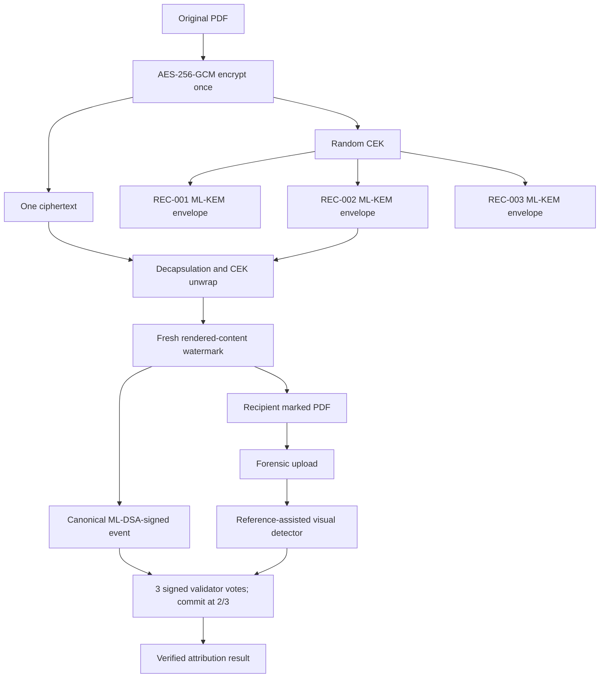

# Architecture and design decisions

**Research prototype. Not an official Ministry of Defence deployment.**

## User journey

The Document Authority signs in, uploads a synthetic PDF and chooses recipients. One random AES-256 CEK encrypts the PDF once. For each recipient, ML-KEM-768 encapsulates a new shared secret; HKDF-SHA3-256 derives a KEK, and AES-GCM wraps that same CEK. A signed-in recipient can access only their addressed document and decapsulate only their own envelope. New decryption sessions render an image-only issued copy before embedding the visual carrier; the event is signed and a validator quorum commits it before download. The investigator uploads a suspected copy; the detector compares rendered pages against the matching authenticated reference, identifies the session, and verifies signed ledger evidence. The auditor explores blocks, runs a separate public-key verification process and performs the demonstration-only one-replica tamper test.

## Data flow

## Cryptographic flow

- Keys: true NIST-named `MLKEM768PrivateKey` / `MLDSA65PrivateKey` from `cryptography` 50.0.2, backed by its bundled OpenSSL implementation. Startup self-tests keygen, encapsulation, decapsulation, sign and verify. There is no asymmetric fallback.
- Content: one random 256-bit CEK, 96-bit AES-GCM nonce, document ID/version in authenticated associated data.
- Envelope: each recipient's ML-KEM-768 public key encapsulates a unique shared secret. HKDF with SHA3-256, document-bound salt and recipient-bound `info` derives a 256-bit KEK. AES-GCM wraps the same CEK with recipient/document associated data.
- Private identity seeds: sealed under an on-disk 256-bit AES-GCM master key with identity-specific associated data. This is a demo-only key store.
- Signed event: UTF-8 NFC JSON, recursively sorted keys and fixed compact separators. Floats are excluded from signed objects. The signature includes a domain-separation context.
- Integrity hashes: SHA3-256 for original, encrypted and marked files, events and blocks.

## Visual watermark

Each decryption chooses a fresh session UUID and random nonce. An HMAC-SHA3 seeded pattern derived from session, document, nonce, page index and an application secret selects a 24×32 low-opacity dot grid. New issued copies rasterize the authenticated PDF into image-only pages before PyMuPDF adds the transparent carrier; the signed event records `RENDER_LOCKED_V1`. This removes the easy selectable-text copy path, at the cost of searchability/accessibility. Legacy marked copies use their original searchable reference. The detector rasterizes suspect and authenticated reference pages at 140 dpi, computes a residual at grid sites and correlates it against issued-session patterns. On an inconclusive first pass, a bounded OpenCV ECC alignment compensates for small digital shift/rotation before checking the same signal and winner margins. PDF metadata and exact file hash do not drive the match. The score is a correlation, **not a probability**. Three synthetic PDFs passed exact, re-render, 90% resize, JPEG 65, 2-pixel shift and 1-degree rotation, while unmarked and text-only reconstructions stayed inconclusive; see `UPGRADE_EVIDENCE.md`. Physical print/scan and adversarial re-creation are unproven.

## Ledger design

Three logical validator IDs have separately stored SQLite block chains and ML-DSA-65 signing identities. A block core includes version, height, previous block hash, UTC time, event SHA3-256 hashes, event root and proposer ID. Its hash is SHA3-256 of canonical core bytes. Each vote signs version, validator, height, block hash and `APPROVE` decision. At least two valid approvals are required before a recipient copy is released. Verification recomputes genesis, previous links, block/event/root hashes, recipient signatures, validator signatures, vote uniqueness and 2-of-3 matching chain heads. A separate process now repeats those checks with read-only databases and public keys. A single corrupted replica is flagged `DIVERGED`; two matching replicas retain the authoritative chain. Signing and coordination remain on one host, so this is not independent network consensus.

## Data entities

`User`: account ID, role, optional recipient ID and salted password hash. `AuthSession`: hashed random bearer token, CSRF token and expiry. `Recipient`: fictional ID, name, designation, status, public keys/fingerprints, sealed private seeds. `Document`: original/ciphertext hashes, classification, encrypted file path, sealed authority CEK, nonce. `RecipientEnvelope`: recipient, KEM ciphertext, wrap nonce, wrapped CEK. `DecryptionSession`: recipient, document, event, time, marked file/hash and commitment. `DecryptionEvent`: canonical payload, recipient signature/public key, block height. `LedgerBlock`: canonical core, event list, approvals and hash. `ValidatorVote`: signed block decision. `Investigation`: suspect hash and result JSON. `AuditRecord`: operational action and time.

## API and screens

The frontend uses live `/auth/login`, `/auth/me`, `/auth/logout`, `/dashboard`, `/system/status`, `/documents`, `/recipients`, `/decrypt`, `/sessions/{id}/download`, `/events/{id}/verify`, `/ledger/blocks`, `/ledger/verify`, `/forensics/analyze`, evidence exports and demo tamper/restore routes. The API checks each role and recipient ownership independently of the UI. Sessions use an HttpOnly SameSite cookie and mutating requests require a CSRF token. Screens: Public role landing page and login, Dashboard, Documents & Distribution, Recipients, Decrypt, Ledger, Forensics, System and Help. The signed-out landing page explains the four roles and links each to the local sign-in. All primary navigation items open working screens. Assets, icons and the limited Hindi label dictionary are bundled locally.

## Current official UI references

Primary UI research used the [Department of Defence Production](https://www.ddpmod.gov.in/en), [Rashtraparv portal](https://rashtraparv.mod.gov.in/), [Ministry of Defence](https://mod.gov.in/) and the Government of India's [GIGW 3.0 guidelines](https://guidelines.india.gov.in/). The interface borrows accessible hierarchy, utility links, document register patterns and trust cues without copying their logos or layout. The persistent prototype banner prevents confusion with an official deployment.

Technical standards: [NIST FIPS 203](https://csrc.nist.gov/pubs/fips/203/final), [NIST FIPS 204](https://csrc.nist.gov/pubs/fips/204/final), [OpenSSL 3.5 documentation](https://docs.openssl.org/3.5/man7/EVP_PKEY-ML-KEM/) and [cryptography ML-KEM API](https://cryptography.io/en/latest/hazmat/primitives/asymmetric/mlkem/). Algorithm usage does **not** imply FIPS certification.
